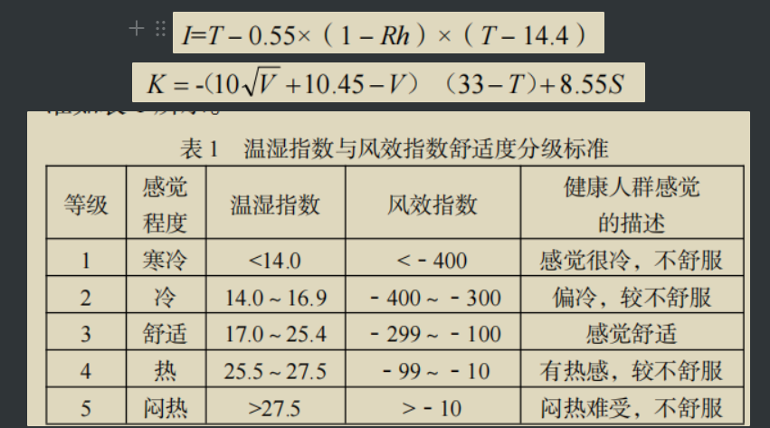

# 体感舒适度及其评价模型

1\

去年我在学习城市化这一主题时，顺便发现了一个现象：人体的体感舒适度和气候类型（诸如温带海洋性气候、温带季风气候、地中海气候等等这样的类型）没有对应关系，全球体感最舒适的城市通常属于完全不同的气候类型。这就产生了一个疑问，体感和哪些气候因素有关，模型是怎样？

这个问题之所以重要，是因为一个城市的发展潜力和气候强相关。同时，影响城市发展潜力的另一个强因素是人才的流入意愿，而影响人口意愿的首要因素就是城市气候所带来的的体感舒适度。

一年过去了，我突然想起这个问题。好在针对类似这样的问题已经有现成的论文，很容易找到。

2

总的来说，影响体感的主要气候因素是：大气温度、相对湿度、风速、日照时数。

作为日常的不太精确的评价，仅仅使用这四个参数，就可以尽管粗略但是非常有用的比较城市之间的体感差异。而且，对于维度差异不大的两个城市，只需要考虑前三个因素。

例如，杭州VS深圳。这两个城市的风速和日照时数差异不大，只需要比较气温和湿度。深圳的湿度在多数时段都太高；杭州的全年最高气温太高，且最低气温太低。两者很难说哪个更好，你喜欢哪个其实在于你对气温和湿度的取舍。

例如，杭州VS陵水（属于大三亚地区，湿度低于三亚市）。气温，陵水显著优于杭州；湿度，两者差异不大；风速，两者差异不大；日照时数，陵水显著优于杭州。这就没有个人偏好的空间了，陵水完爆杭州。\

3\

以上四个因素，如果再简化，可以简化为两个因素：气温和湿度。

体感温度，以大气温度为基础，然后受气压、风速、湿度影响，尤其是湿度。简化一下，体感温度的主要变量是大气温度和湿度。

人并不感知气温，人感知的是经由皮肤与大气进行热量交换时损失或获取热量这一变化的速率。而水的比热容大于空气，空气中湿度越大，人体与空气热交换的速率越大。

也就是说，如果气温高于人体温度，人会觉得热，湿度越大，人觉得越热；如果气温低于人体温度，湿度越大，人会觉得越冷。杭州的40度会比西安的44度更热（西安基本不会有44度）；杭州的4度，会比西安的零下4度更冷。

\

4

\

如果要再稍微认真一点，那么可以使用两个模型：温湿指数（THI）、风效指数（WEI）

5

作为吃瓜群众，我们再来看一下更专业的两个模型：人体舒适度指数（CIHB）、热气候指数（UTCI）。

至此，我去年产生的疑问得到了解答。
