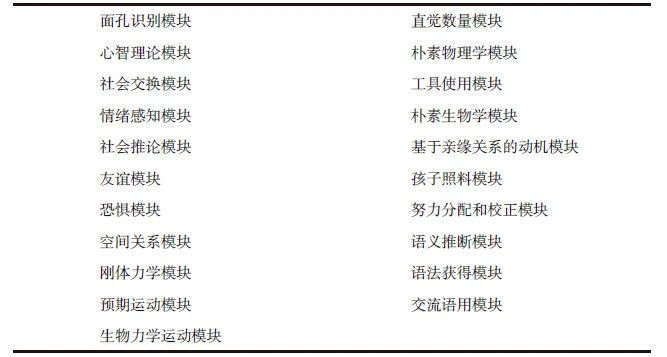

# 认知科学

认知科学，是一个模糊的范畴，大致相当于摇滚音乐。这个类比包含两个相似点，第一，两者起源时间大致相同；第二，两者都是多种跨学科的学科之间的综合，没有明确的边界。

简单来说，认知科学涉及到六个基础学科相互之间的跨学科：哲学（认识论）、心理学（行为科学、认知心理学、进化心理学）、计算机科学（人工智能）、神经科学（神经生物学）、语言学（认知语言学）、人类学。除了这六个基础学科以外，还有一个额外的板块，决策理论。

我初步接触神经科学时，发现一个明显很好玩的地方，即传统经济学和广告业，是基于完全对立的假设。传统经济学的基本假设是“理性人”，广告理论的基本假设是“没有理性”。在消费主义的背景下，似乎传统经济学更需要大幅度修正，当然现代经济学家早已经在做这项工作。

**大脑的两套认知系统**

人的大脑有两套认知系统。第一套是自发式系统（这个术语将全面替代我以前使用的“非理性”和“情绪”），第二套是分析式系统。各自有独立的目标结构，和独立的用以实现这些目标结构的机制。

自发式系统更多对应基因的目标结构。简单来说，人是基因的载体，基因的目标只关心基因的利益（主要是复制自己，在载体上的表现就是繁殖），基因的利益和载体的利益多数时候一致，但有发生冲突的时候，在现代社会，基因与人的利益发生冲突的可能性越来越大。例如，在不打算生育的情况下男人需要戴套，就是分析式系统覆盖自发式系统，执行载体的目标，牺牲基因的目标。

这两套系统在很多文献中有别的名字，如下：

其中，自发式系统，包含众多模块，举例如下：

也就是说，自发式系统，不仅包含“刺激-反应”类的原始模块，也包含“语言”类的高级模块。语言学中有一派观点，认为“语言”是人的天性，类似于鸟能飞蜘蛛能织网，也就是说也属于原始模块。这一派观点参见 Steven Pinker 的 "The Language Instinct: The New Science of Language and Mind"。鉴于我目前尚未为完成对语言学板块的框架性了解，我暂时还是把“语言”模块归入高级模块。

自发模块在多数情况下都对人有益，例如，篮球运动员抢篮板，足球运动员抢点射门，都涉及非常精密的对球的落点的判断，这就属于上表的“生物力学运动“模块。

对自发式系统有一个很好的类比，瑞士军刀。人的第一套认知系统，不是用一个工具处理多种问题，而是不同问题对应不同的专用模块。

对自发式系统还可以有一个类比，即众多的专用芯片，或众多的单片机。而分析式系统则相当于通用计算机的中央处理器。

把分析式系统看成中央处理器不是一个好类比，因为容易让人误解大脑中有个与之对应的硬件实体，这不仅在生物学上是错的，而且在哲学上也站不住脚。事实上，分析式系统对应到大脑的硬件上，也并不是集中式的，而是分布式的。更准确的讲，分析式系统相当于在硬件之上的虚拟机。

**两个相反的观念**

“自发式系统”的形成过程，是以遗传适应度为明确目标，或者说这是生物演化的目标。我们很多时候所追求的，与生物演化的目标并不一致。在发生冲突时，我们应该怎么办（暂时不考虑“我”和“我们”是个什么东西）。这在学术界是长久争论的问题。简单来说，有一派以进化心理学为代表倾向于让自发式系统主导，原因是自发式系统作为经过百万年的演化的结果和环境是契合的。市面上长期流行的心灵类、自我帮助类图书的理论源头大致在此，可以称为“跟随内心”派。

包括我以前写的文章的观点，也是倾向于进化心理学的主张。

对此提出反对的，则主张以“分析式系统”为主导。原因是，现代社会早已不是原来的自然的生物演化环境。

**在重大问题上，我们需要有至少两个相反的观念。**

那么，如果不“跟随内心”，我们唯一能依赖的工具是，理性。

**界定理性**

这张图是界定人类理性的最简化模型。

图中的“信念”，是客观世界在人脑中的映像。人并不能直接感知客观世界，人能感知的是客观世界在脑中的映像（投影）。每个人都有众多“信念”，按照一定的形式组织起来，这个有结构的整体就是“信念结构”，约等于“世界观”。“信念结构”，我之前写的《[“关系”世界观](http://mp.weixin.qq.com/s?__biz=MjM5NzE3MTc4Mg==&mid=2651278829&idx=1&sn=0fc5ae2be7e7800dfe3de3e5061d7dd5&chksm=bd2deac48a5a63d2a648f31e2ad034d3c7dc73c6d7e65d31a2faf74d863703dbae7e070abe03&scene=21#wechat_redirect)》可以作为一个实例。

图中的“欲望”，还是按一定形式，构成“欲望结构”。这里的“欲望”，在分辨精度不需要更高的情况下，和哲学上的“意志”可以视为同义词。或者也可以说是“目标”。

基于对世界的“信念结构”和个体的“欲望结构”，个人按一定算法做出选择，对外表现为“行为”。这个过程，就是“理性”。

把“理性”再作一层细分。

“狭义理性”或“工具理性”，根据当前“信念”和“欲望”做出行为决定。内在要求是，“信念结构”内部的一致性，和“欲望结构”内部的一致性。这是很高的要求。我们在日常生活中表现出两个自相矛盾的“信念”和自相矛盾的“欲望”很常见。

超出这个范围的是“广义理性”。“广义理性”包括，对“信念”是否真实反映客观世界做出重新评估，对“信念结构”内部的不一致做出评估，对“欲望结构”内部的不一致做出评估，对“欲望”是否有足够的“信念”基础做出评估。

这张图在前一张图的基础上增加了箭头D，即“欲望”会调整“信念”形成过程，包括，对“信念”是否真实反映客观世界做出重新评估，以及“欲望”对多个“信念”之间的不一致检测。而这张图没有呈现的其他因素还包括，“欲望”的形成过程、“信念”调整“欲望”的可能性。

**两个反理性源头**

“信念”和“欲望”的形成过程所需的信息来源不仅包括自然界，或者说不仅包括生物演化环境，或者说不仅包括物理世界，还包括文化。

对应生物演化环境的主体是“基因”。

对应文化演化环境的主体是“模因”。“模因”和“基因”类似，它们的目标是自我复制。“模因”是人类的全部知识、观念、观点、概念、思想的基本单元，类似于“基因”是有机体的基本单元。

有的“模因”与人作为载体的利益一致，例如，“加法交换律”。

有的“模因”是无用的。例如，“不转发这条消息你就会倒霉”。和很多垃圾“基因”一样，这类“模因”不起任何作用，它们只是搭顺风车不断复制自己。我亲眼见过以这个结构为基础的垃圾消息在2000年的QQ、2010年的微信、2020年的短视频平台传播，并且我了解到在更早的还没有windows这类可视化操作系统时就已经在email广泛传播，可以想象在更遥远的年代通过口口传播的情况，可以说是生生不息。

有的“模因”与人的利益冲突，例如，极端宗教组织的观点，恐怖分子因为持有这类模因而选择去死。更普遍的例子包括广告业的广泛成功、社交媒体的人们热门内容，等等。

认知的“分析式系统”需要同时警惕“基因”和“模因”有造成反理性行为的可能。

**理性的算法**

如果只是针对来自“基因”的反理性行为，还可以有有效的算法来保证“分析式系统”对“自发式系统”的监控。

但“模因”是通过“分析式系统”起作用，它所导致的反理性行为，现在似乎还没有特别有效的算法。且不那么有效的算法也已经过于复杂，涉及惨绝人寰的“递归调用”，大致涉及到对“欲望结构”中“一阶欲望”“二阶欲望”“高阶欲望”的全面评估，不同于传统哲学的算法用“高阶欲望”为标准评估“低阶欲望”，现代算法中的“各阶欲望”都没有特权。我不认为人脑具备足够的计算资源来执行这类算法。这也是我以前的文章观点倾向于尽量使用“自发式系统”以尽量节省“分析式系统”的计算资源的原因。

为了避免显得过于针对“基因”而不对“模因”引起重视，我在这里连针对“基因”的算法也一并不作描述。

作为一个不太合格的替代，我把矛头指向另一个概念，“智力”（或者日常语言中的“智商”，以及形容词“聪明”）。“智力”和“理性”有什么区别？

**智力与理性的区别**

人的认知有多个层级。  

“智力”属于“指令层级”。这个层级包括输入编码机制、短时记忆存储、长时记忆存储，等等。例如，我们不经意看到一个人的脸，只看了一眼，视觉对图像进行编码，存储在短时记忆中，跟储存在长时记忆中的信息进行比对，要是两者匹配，我们就发现认识这个人，然后做出相应决策，跟这个人打招呼。

“理性”属于“意图层级”。例如，我们看到一个认识的人，由于某种意图，不跟他打招呼。

位于“意图层级”的“理性”，关心的是系统目标，在“欲望”和“信念”的结构中的行动选择。位于“指令层级”的“智力”，并不涉及目标评估，不涉及“信念-欲望”结构的评估，不涉及“信念”是否真实反映外部世界的评估，只涉及执行算法的效率的高低。

**回到逻辑**

“逻辑”这个词在日常生活中被滥用了。实际上它没有通常理解的那么重要，也没有通常理解的那么不重要。

“逻辑”涉及两个基本要素，第一是“前提”，第二是“推理”。这意味着，“逻辑”是去语境化的。例如：

我们给定：

前提1：3\*3=2为真

前提2:  2=5为真

推论：3\*3=5为真

这是完全符合逻辑的。有前提，推理步骤正确，这就是“逻辑”所管的范围。至于3\*3是不是等于2（前提是否需要重置），这不归“逻辑”管。面对这种情况，你可以说这三步是错的，错在两个前提都不具有普适性，但你不能说这三步是不符合逻辑的。

“逻辑”属于“智力”，属于“指令层级”，它上面还有“意图层级”的“理性”。但是，理性的算法过于复杂，且不太有效。这可能就是每个人普遍的处境。

一个可行的方案是，必须引入一个假设前提，作为“信念结构”中不接受理性评估的“信念”，可是，妈逼的这不就回到了宗教的老路上去了吗。

没想到推导出来是这样。

等一下，我再回去看看那些惨绝人寰的“递归调用”算法。

\_\_

