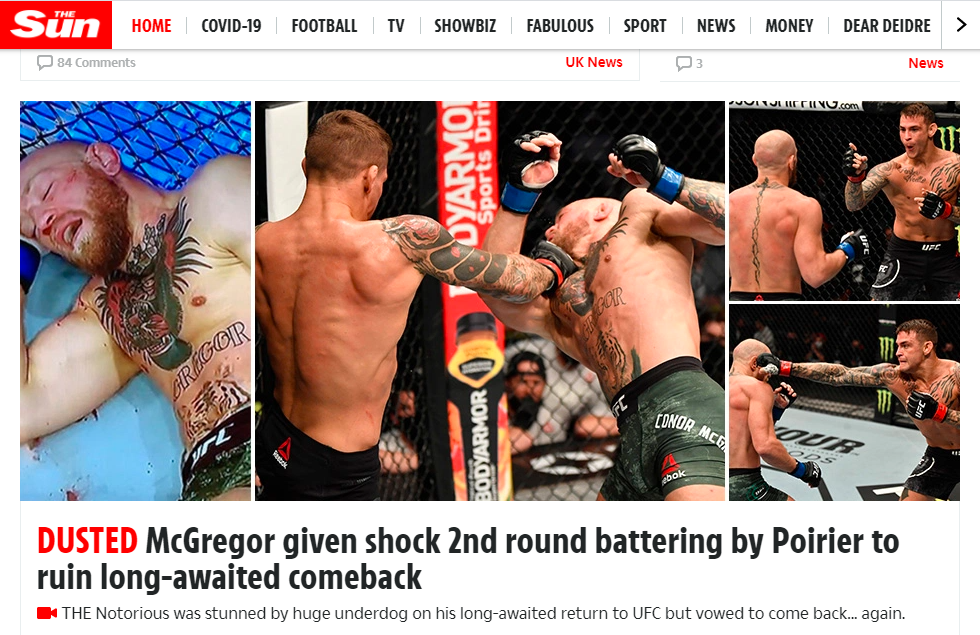

# 通俗小报类新闻和花边新闻

## 新闻的框架​

中文的“新闻”一词，包含两层含义，第一是Journalism，第二是News。对没有受过新闻专业训练的人来说，对“新闻”一词的理解通常是News。本文中使用的“新闻”指Journalism，大致等同于通过媒体获取的所有信息，以及传递和获取信息的全部过程。


传递和获取信息的过程可以分为三个环节：生产-分发-消费。


新闻，存在不同维度的分类，每个维度下再分类型。例如其中一个维度是媒介：纸质、音频（广播或播客）、视频（电视、互联网视频）。传统的成熟的新闻媒体，不管本来是报纸还是杂志，后来都会有自己的网站、自己的APP、社交平台账号、以及被google news之类的新闻聚合类产品收录。这些维度对新闻消费者来说不重要（对新闻生产者和分发者来说很重要）。

我这里简化地只描述对消费者来说重要的两个维度：

* 话题光谱。从最硬到最软，有一个连续统：政治——经济——商业和金融——技术——科学普及——教育——健康-——体育——娱乐和艺术（包括电影、电视剧、戏剧、音乐等）——娱乐八卦（通常是关于体育名人、演艺名人、猫狗等小动物的私生活）
* 事实——观点——情绪。严格来说这也是一个连续统，除了数学知识，并没有什么信息是纯粹的事实。作为新闻消费者，至少对任何一条信息，需要区分它是描述事实，还是解释或论证观点，乃至诉诸情绪。（有一个很简单的标志：描述事实字数会很少，解释观点会有清晰的论点论据结构。对于多数严肃新闻来说，第一个段落就是描述事实，很多情况下只看第一段就可以了。）


除以上两个维度以外，还有一个维度与新闻消费者关系比较密切：心理距离的远近，或者说抽象层级的高低。这个维度大致可以划分为以下新闻类型：宇宙——全球——区域——国家——省——市——社区

后一个类型相对前一个类型来说，都可以被称为“本地新闻”。


## 通俗小报类新闻和花边新闻

这个概念对应的英文有：tabloid journalism, yellow journalism, tabloid newspapers, red top tabloids, red tops, scandal sheets, rag newspapers（最后这一个是严肃媒体对小报的侮辱性称谓\)。

这个新闻类型，位于整个新闻业的框架之类。按我上面给出的二维模型，在话题维度，位于整个光谱最软的一端。

我之所以不列其它类型，而把这个类型单列出来，是因为，这个类型被占据话语权的严肃媒体\(话题维度上位于最硬的那一端的新闻机构\)所看不上，但实际上是人们接触最多的新闻类型。这个新闻类型，是人类的新闻业发行量最大的部分，不管是用哪种语言。最近十年的趋势，整个新闻中被消费最多甚至都不是名人八卦，而是猫猫狗狗的私生活。（近两年由于短视频作为媒介类型的发达，对小动物的内容消费甚至都不仅限于猫猫狗狗，还有狮子、老虎、狼、美洲豹等等。）

### 新闻机构

* 不仅仅有这些严肃的：CGTN, AP, Reuters, NPR, The Guardian, ABC News, BBC News... （核心定位是政治。为了获取更高的阅读量，也会往软的一端延伸。）
* 不仅仅有这些次严肃的：AFP, Economist, Wall Street Journal...（核心是经济到金融。为了获取更高的阅读量，也会往两端延伸。）
* 还有这些不严肃的：
  * 英国：The Sun, the Daily Mail, Daily Express, Daily Mirror, Daily Star, Daily Record, Sunday Mail...
  * 美国及北美：New York Post, National Enquirer, Globe..
  * 中国的不用列了，随便找一个新闻排行榜（例如新榜的微信公众号影响力排行榜），排在前面的账号基本都是这个类型。


这里只列了新闻中最严肃的和最不严肃的部分。而中间地带，最典型的是，健康（含医疗）和教育，在全球的新闻光谱中也是最薄弱的，在中国尤其薄弱。

中国的媒体内容里，占据“健康”这个频带的内容实际不是健康，而是迷信和以讹传讹；占据“情感、情绪”（属于教育的子版块）这个频带的内容实际不是情感教育，而是迷信和情绪煽动；占据“教育”这个频带的内容实际不是教育，而是卖课程的广告。


## 严肃新闻和不严肃新闻的对比

不用看字，一眼看上去，就是后面这种比较带劲嘛。

但是如果看字的话，不仅是话题选择有区别，在语言层面也有区别。前者所用语言属于“新闻语域”，有这个语域的专有词汇，遵循严格的写作规范；后者使用的句型和词汇会更接近口语，句子也更短。

很多人为了学英语，被错误地引导到看严肃类新闻。其实后面这类不严肃新闻才是更好的语言学习素材。它不是多么高大上的内容，但是它是更好的语言学习素材。新闻整个语域，都不是好的语言学习素材，但不严肃的这一类在整个新闻里相对较好。

甚至对于一些商科专业的学习，前面的严肃新闻也不是好的素材。

## 商科学生的错误

我曾经帮朋友做过两次MBA课程的作业。两次都是基于《经济学人》的文章做分析。

第一次的文章相对来说不太涉及专业领域，主要谈论的是疫情引起的一个变化，商用写字楼出租大幅缩水，这个变化可能是不可逆的。也就是说，很多企业在疫情中被迫远程协作而不用雇员到公司上班，通过这个过程，这些企业发现，其实并不需要租写字楼。这次的作业我做了，不在话下。

第二次的文章就明显涉及金融专业，有很多术语，那不是词汇认不认识的问题，那是背后有没有一套完整的金融专业的知识结构的问题。我没有。而且，那篇文章不是学术性的写作，而是那种夹叙夹议还带抒情的写作。如果是学术写作，我就会知道哪些词汇是准确的术语，我还可以恶补，还可以抢救；但如果是抒情的话，哪些表面上是术语的东西，其实有可能只是比喻，而我完全不知道比喻的是什么；而且还涉及到人物的典故，人物和人物的关系，不是那个领域的老玩家就不可能看懂。

这类似于，我用中文写

> 当神一般的马拉多拉在亚平宁半岛呼风唤雨的时候，巴蒂斯图塔还在潘帕斯草原放牛。
>
> 维多利亚的小伙子，贝克汉姆，被恶棍西蒙尼的脚后跟绊倒在法国的草地上，他无论如何也想不到，后者会在22年后带领西班牙军团杀回英格兰，通过在两肋的调度和内切，在利物浦的安菲尔德笑到最后。

这种垃圾风格。如果你看不懂，如果你不是20年以上的球迷当然看不懂，那显然不是你的问题。这跟语言无关，这甚至跟专业领域无关，这完全只是一点无关痛痒的专业以外的花边。

我们作为金融业的外行，能知道巴菲特是谁，但不会知道金融界的巴蒂斯图塔和西蒙尼是谁。更不知道他们之间有些什么关系。

我认为这类MBA的作业是在扯淡。不能随便以某一个媒体的文章作为分析对象，不能以某一个媒体或多个媒体作为专业知识的入口。只能以课程大纲为入口，有可能会关联到其他的书或者杂志的某一篇文章，而那篇文章应该是和课程设计强相关的，并且应该是偏向于学术写作，而不应该是新闻的一个子类feature stories。

**一点题外话**

在帮朋友做作业之前，我从来没有看过《经济学人》的正刊，只看过副刊的一个语言学专栏，那个专栏试图论证，美式英语是保守的一方，英式英语是变化更多的一方。它有一个例子是，受美剧friends的影响，伦敦人改变了一些习惯的句型。

基于我对英国和美国各自出版的英语教材的比较，一定程度上我赞同这个专栏的说法。

针对母语者。例如，在美国使用较多的万能否定助动词**ain't**（和全球的多处方言有关，并不只在美国使用，也并不只是非裔使用），在美国并不被学院派接受，美国的英语老师有可能会简单粗暴的把这个现象解释为孩子气和缺乏教育；而在英国使用较多的万能tag问句  **innit**（由isn't it? 的连读衍生出来的词），并没有受到什么反对。而innit其实比ain't省略更多，ain't仅仅是助动词不用变形，innit是组动词+人称代词都不用变形。

针对外语者。例如，英国有一个教育和出版机构在提倡取消第三人称单数的动词变形。

