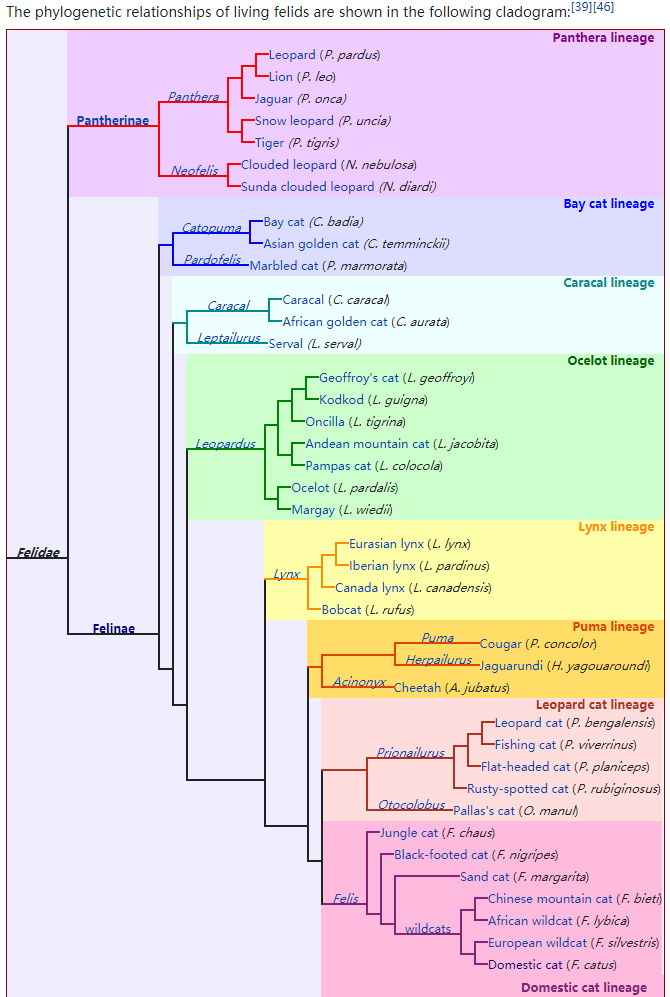
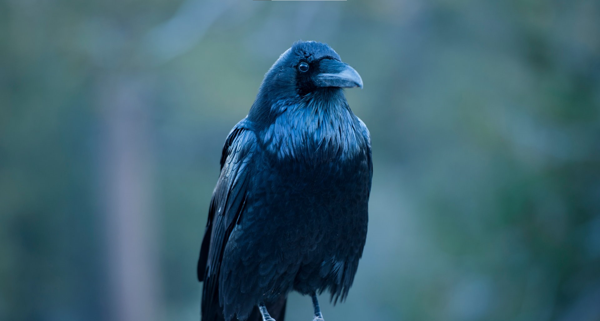
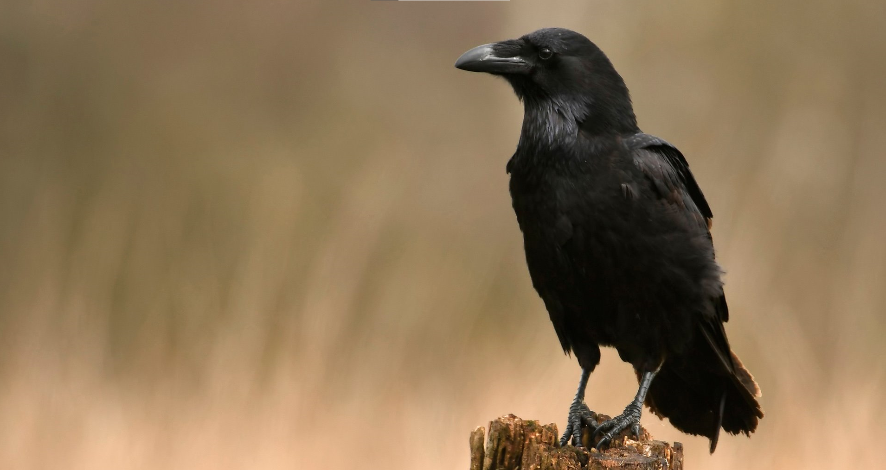
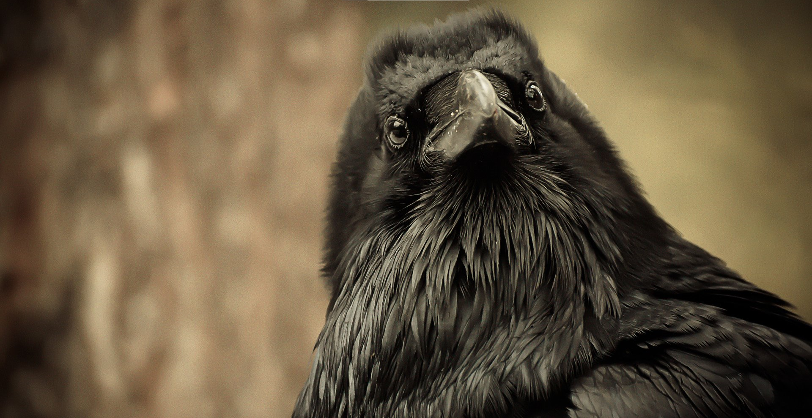

# Crow

I have set the my laptop wallpaper as a group of pictures of crows. I didn't mean to do it, I didn't deliberately look for crow pictures. The other day I just wanted to find some dark-colored pictures glimpsed at night for my eyes' sake.

Coincidentally, while today I was reading a short story, the word "crow" jumped into my sight in the story's context that the warm days of spring started to come and green corn plants began to show. "The big black birds were hungry." read the story.

Then I began to think about crows.

Like other animal species' names, "乌鸦" , "crow", "raven" are ambiguous terms, I guess. I looked up the difference between a crow and a raven. A raven is bigger than a crow, like a rat is bigger than a mouse. There are much more different features between them of course, but they don't matter.

I once felt it did matter before. I had check up species of big cat, or feline animal \(strictly, Felidae, as a technical term\), of two main families \(not being extinct\), which are Felinae \(猫亚科\) and Pantherinae \(豹亚科\). This was the end of my enthusiasm for big cats. Because I found the two families are very large and very complicated. Like this

When you get there, you must suspend, whatever it's about. Big cats, black birds, plants, humans, relationships, lives, whatever.

I have learnt my lessons from those things.

But still I have to say, there is some significant importance over there. Take crows for instance.

In our traditional culture, crows are a sign of bad things, because of their color, their sound, and what they feed on. However, at least many of our generation and after, almost never saw or heard or felt any crows in our real lives at all. We just heard of some stories or watched of some TV images, not about the fact but about some emotion or some inferior and terrible artistry, being absent-minded. All these things are not crows but virtual projections of them. What those things stand for is our notions have been formed by other notions, even worse, by other emotions. That is, we have never formed our concepts, notions and opinions from the real world.

Bad artistry is there, trying to evoke your vague fake _emotions._

Good pictures let you clearly see what it is.

it's a bird, with black feathers, innit?

It has nothing to do with any story, emotion, sign, symbol, or metaphor.

At least in the first place, we don't need to give a fuck about those fantasies.

We don't need to tell what it is about, or what it represents, or what it means; We need to tell what it is. Not just for crows, but for everything.

